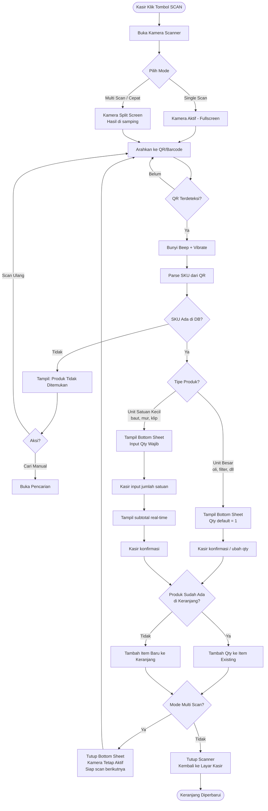

# Desain Fitur Scan — QR Code & Barcode
## Sistem Pelabelan Produk POS Sparepart

**Versi:** 1.0 | **Tanggal:** Maret 2026

---

## 1. Keputusan: QR Code vs Barcode?

### Perbandingan Langsung

| Aspek | Barcode (1D) | QR Code (2D) |
|---|---|---|
| Data yang tersimpan | Hanya angka/teks pendek (SKU) | SKU + nama + harga (opsional) |
| Ukuran label terkecil | Min ~2cm lebar | Min ~1.5cm × 1.5cm |
| Scanner hardware | Wajib (Bluetooth scanner) | Tidak wajib — kamera HP/tablet cukup |
| Kecepatan scan | Sangat cepat (< 0.5 detik) | Cepat (< 1 detik) dengan kamera bagus |
| Tahan kotor/sobek | Sebagian — butuh garis penuh | Lebih toleran — 30% rusak masih terbaca |
| Cetak sendiri | ✅ Printer biasa | ✅ Printer biasa |
| Cocok untuk kotak penyimpanan | Kurang (butuh orientasi) | ✅ Sangat cocok (scan dari sudut manapun) |
| Biaya scanner | Rp 200–500rb (Bluetooth HID) | Rp 0 — pakai kamera device |

### Rekomendasi: **QR Code sebagai Standar + Dukungan Barcode Bluetooth**

**Alasan:**
1. QR Code = scan pakai kamera tablet/HP yang sudah ada → **hemat biaya**
2. QR Code bisa tempel di kotak sudut manapun → **kasir tidak perlu positioning label**
3. Tahan kondisi toko otomotif: kena oli, debu, setengah tertutup
4. Jika di masa depan beli Bluetooth scanner → tetap kompatibel (mode input HID)
5. QR Code bisa encode lebih banyak info: `{"sku":"OLI-001","name":"Oli Repsol","price":45000}`

---

## 2. Arsitektur Sistem Scan

```
┌─────────────────────────────────────────────────────────────────┐
│                    SISTEM SCAN                                   │
│                                                                  │
│  INPUT METHOD 1: Kamera Device                                   │
│  ┌────────────────────┐                                          │
│  │  expo-camera        │ → Scan QR Code / Barcode via kamera    │
│  │  (Built-in scanner) │   tablet atau HP kasir                  │
│  └────────────────────┘                                          │
│                                                                  │
│  INPUT METHOD 2: Bluetooth Scanner (HID)                         │
│  ┌────────────────────┐                                          │
│  │  Text Input Focus   │ → Scanner Bluetooth kirim data seperti  │
│  │  (Auto-detect)      │   keyboard → ditangkap input tersembunyi │
│  └────────────────────┘                                          │
│                                                                  │
│  PROSES:                                                         │
│  QR/Barcode data → Parse SKU → Cari di database → Tambah Cart   │
│                                                                  │
│  OUTPUT:                                                         │
│  ┌────────────────────┐                                          │
│  │  QR Generator       │ → Generate QR per produk → Print Label  │
│  │  react-native-      │   (PDF A4 / thermal label printer)      │
│  │  qrcode-svg        │                                          │
│  └────────────────────┘                                          │
└─────────────────────────────────────────────────────────────────┘
```

### Library yang Digunakan

```
Scanning:    expo-camera v15 (built-in barcode scanner)
             → Support: QR_CODE, EAN13, EAN8, CODE128, CODE39, ITF14

Generate QR: react-native-qrcode-svg
             → Output SVG, bisa di-embed ke PDF label

Print Label: expo-print + expo-file-system
             → Generate HTML → PDF → Print / Share

Format data QR:
  Simple:  "OLI-001"                    (hanya SKU, lebih kecil)
  Rich:    {"s":"OLI-001","n":"Oli Repsol","p":45000}   (SKU+nama+harga)
  → Pilih format Simple untuk ukuran QR lebih kecil & scan lebih cepat
```

---

## 3. Konsep Label untuk Kotak Penyimpanan

### 3.1 Masalah Produk Kecil

Produk seperti: **baut M6, mur M8, klip plastik, ring, pin, sekrup** — tidak mungkin ditempel label satu-satu. Solusinya: **label ditempel di kotak/wadah penyimpanan**, bukan di produknya.

### 3.2 Sistem Kotak Penyimpanan (Bin System)

```
Rak/Laci Toko                    Kotak A3
┌─────────────────────────────┐  ┌──────────────────────────────┐
│  [A1] [A2] [A3] [A4] [A5]   │  │  ████████████████████████   │
│  [B1] [B2] [B3] [B4] [B5]   │  │  ██                    ██   │
│  [C1] [C2] [C3] [C4] [C5]   │  │  ██   QR CODE BESAR    ██   │
└─────────────────────────────┘  │  ██     5cm × 5cm      ██   │
                                 │  ██                    ██   │
Label di depan kotak:            │  ████████████████████████   │
                                 │                              │
┌────────────────────────────┐   │  BAUT M8×30mm               │
│  ▓▓▓▓▓▓▓▓▓▓▓▓▓▓▓▓▓▓▓▓▓▓  │   │  SKU: BAU-M8-30             │
│  ▓▓      QR CODE      ▓▓  │   │  Rp 500/pcs                 │
│  ▓▓   4cm × 4cm       ▓▓  │   │  Kotak: C3                  │
│  ▓▓▓▓▓▓▓▓▓▓▓▓▓▓▓▓▓▓▓▓▓▓  │   └──────────────────────────────┘
│                            │
│  Baut M8 × 30mm            │
│  BAU-M8-30  |  Rp 500/pcs  │
└────────────────────────────┘
```

### 3.3 Ukuran Label per Jenis Produk

| Jenis Produk | Ukuran Label | Ukuran QR | Posisi |
|---|---|---|---|
| Oli, filter, sparepart besar | 3cm × 5cm | 2cm × 2cm | Di produk langsung |
| Kotak baut/mur (isi banyak) | 6cm × 4cm | 4cm × 4cm | Di depan kotak |
| Laci/drawer kecil | 4cm × 3cm | 2.5cm × 2.5cm | Di laci |
| Rak/bin besar | 8cm × 6cm | 5cm × 5cm | Di depan rak |

### 3.4 Format Data QR di Label Kotak

```
QR berisi: "BAU-M8-30"   ← hanya SKU

Saat di-scan kasir:
→ Sistem cari SKU "BAU-M8-30" di database
→ Tampil: "Baut M8×30mm — Rp 500/pcs — Stok: 847 pcs"
→ Kasir input QUANTITY (berapa pcs yang dijual)
→ Tambah ke keranjang
```

**Mengapa hanya SKU?** — QR code lebih kecil, lebih mudah dibaca kamera, dan harga di-update dari database (bukan dari QR).

---

## 4. Mockup Layar Scanner

### 4.1 Scanner Overlay di Layar Kasir

```
┌──────────────────────────────────────────────────────────────────────────┐
│ ←  KASIR             👤 Budi (Kasir)                           [📷 SCAN]│
├──────────────────────────┬───────────────────────────────────────────────┤
│                          │                                               │
│  🔍 Cari produk/SKU...   │   KERANJANG (3 item)                          │
│   ──────────────────     │   ─────────────────────────────────────────── │
│  [Semua][Oli][Filter]    │   Oli Repsol 20W50 1L     × 2   Rp 90.000    │
│                          │   ─────────────────────────────────────────── │
│  [Grid produk...]        │   ...                                         │
│                          │                                               │
└──────────────────────────┴───────────────────────────────────────────────┘

Saat tombol [📷 SCAN] ditekan:

┌──────────────────────────────────────────────────────────────────────────┐
│                                                                          │
│  ┌────────────────────────────────────────────────────────────────────┐  │
│  │                                                                    │  │
│  │                 KAMERA AKTIF (Fullscreen)                          │  │
│  │                                                                    │  │
│  │         ┌─────────────────────────────────┐                       │  │
│  │         │                                 │                       │  │
│  │         │   ╔═══════════════════════╗     │                       │  │
│  │         │   ║                       ║     │                       │  │
│  │         │   ║   Arahkan QR/Barcode  ║     │                       │  │
│  │         │   ║   ke dalam kotak ini  ║     │                       │  │
│  │         │   ║                       ║     │                       │  │
│  │         │   ╚═══════════════════════╝     │                       │  │
│  │         │         ~~~ animasi ~~~         │                       │  │
│  │         └─────────────────────────────────┘                       │  │
│  │                                                                    │  │
│  │   [💡 Flash ON/OFF]              [✕ Tutup Scanner]                │  │
│  └────────────────────────────────────────────────────────────────────┘  │
│                                                                          │
│  Mode: [QR Code ✓]  [Barcode]        Scan otomatis saat terdeteksi      │
└──────────────────────────────────────────────────────────────────────────┘
```

### 4.2 Setelah QR Terdeteksi — Produk piece Normal (Filter, Busi, Kunci)

```
Scan terdeteksi → Bunyi "beep" → Tampil bottom sheet:

┌──────────────────────────────────────────────────────────────────────────┐
│  ════════════════════════════════════════════════════════════════════    │
│  ✅  PRODUK DITEMUKAN                                                    │
│                                                                          │
│  Filter Udara Honda Beat                                                 │
│  SKU: FLT-UDR-BEAT  |  Kategori: Filter                                │
│  Harga: Rp 35.000 / pcs  |  Stok: 12 pcs                               │
│                                                                          │
│  Jumlah:  [−]  [ 1 pcs ]  [+]                                          │
│                                                                          │
│  ┌─────────────────────────┐   ┌─────────────────────────────────────┐  │
│  │       BATAL             │   │    + TAMBAH KE KERANJANG            │  │
│  └─────────────────────────┘   └─────────────────────────────────────┘  │
│  ════════════════════════════════════════════════════════════════════    │
└──────────────────────────────────────────────────────────────────────────┘
```

### 4.2b Setelah QR Terdeteksi — Produk Liquid (Oli, Cairan Rem, Coolant)

```
unit_type = 'liquid', qty_step = 0.5 → tampil kontrol khusus:

┌──────────────────────────────────────────────────────────────────────────┐
│  ════════════════════════════════════════════════════════════════════    │
│  ✅  PRODUK DITEMUKAN — OLI / CAIRAN                                    │
│                                                                          │
│  Oli Repsol 20W50                                                        │
│  SKU: OLI-REPS-001  |  Kategori: Oli & Pelumas                         │
│  Harga: Rp 45.000 / liter  |  Stok: 8.5 liter                          │
│                                                                          │
│  Jumlah:  [−0.5]  [ 1.0 liter ]  [+0.5]                               │
│                                                                          │
│  Pilih cepat:  [0.5L]  [1L]  [1.5L]  [2L]  [3L]  [4L]                 │
│                                                                          │
│  Subtotal:  Rp 45.000                                                   │
│                         ↑ update real-time saat qty berubah             │
│  ┌─────────────────────────┐   ┌─────────────────────────────────────┐  │
│  │       BATAL             │   │    + TAMBAH KE KERANJANG            │  │
│  └─────────────────────────┘   └─────────────────────────────────────┘  │
│  ════════════════════════════════════════════════════════════════════    │
└──────────────────────────────────────────────────────────────────────────┘

Jika kasir pilih 0.5L:
  Qty = 0.5, Subtotal = Rp 22.500
  Stok berkurang 0.5 liter (dari 8.5 → 8.0)
```
Tombol + Tambah → Tutup scanner otomatis? [Ya/Tidak — setting kasir]
                   Default: tetap buka scanner untuk scan produk berikutnya
```

### 4.3 Setelah QR Terdeteksi — Produk Satuan Kecil (Baut, Mur, dll)

```
Scan QR kotak baut → Bunyi "beep" → Tampil bottom sheet KHUSUS:

┌──────────────────────────────────────────────────────────────────────────┐
│                                                                          │
│  ════════════════════════════════════════════════════════════════════    │
│                                                                          │
│  ✅  PRODUK SATUAN — INPUT QUANTITY                                      │
│                                                                          │
│  Baut M8 × 30mm (Zinc)                                                  │
│  SKU: BAU-M8-30  |  Kategori: Baut & Mur                               │
│  Harga: Rp 500 / pcs                                                    │
│  Stok: 847 pcs                                                           │
│                                                                          │
│  ℹ️  Produk ini dijual per satuan (pcs)                                 │
│  Masukkan jumlah yang dibeli:                                           │
│                                                                          │
│  ┌──────────────────────────────────────────────────────────────────┐   │
│  │   [ 1 0 ]  pcs                           Subtotal: Rp 5.000      │   │
│  └──────────────────────────────────────────────────────────────────┘   │
│                                                                          │
│  Pilih cepat: [5] [10] [20] [50] [100]                                  │
│                                                                          │
│  ┌─────────────────────────┐   ┌─────────────────────────────────────┐  │
│  │       BATAL             │   │    + TAMBAH KE KERANJANG            │  │
│  └─────────────────────────┘   └─────────────────────────────────────┘  │
│                                                                          │
│  ════════════════════════════════════════════════════════════════════    │
└──────────────────────────────────────────────────────────────────────────┘
```

### 4.4 QR Tidak Dikenali / SKU Tidak Ada di Database

```
┌──────────────────────────────────────────────────────────────────────────┐
│  ════════════════════════════════════════════════════════════════════    │
│                                                                          │
│  ❌  PRODUK TIDAK DITEMUKAN                                              │
│                                                                          │
│  Kode yang di-scan: "BAU-M8-45"                                         │
│  Produk dengan SKU ini belum ada di database.                           │
│                                                                          │
│  ┌─────────────────────────┐   ┌─────────────────────────────────────┐  │
│  │   SCAN ULANG            │   │    CARI MANUAL                      │  │
│  └─────────────────────────┘   └─────────────────────────────────────┘  │
│                                                                          │
│  ════════════════════════════════════════════════════════════════════    │
└──────────────────────────────────────────────────────────────────────────┘
```

### 4.5 Mode Scan Cepat (Tablet — Multi Scan)

```
Untuk kasir yang melayani banyak item sekaligus (mode toko ramai):

┌──────────────────────────────────────────────────────────────────────────┐
│  📷 MODE SCAN CEPAT                                    [Selesai Scan]    │
├──────────────────────────────────────────────────────────────────────────┤
│                                                                          │
│   KAMERA ½ LAYAR              │  HASIL SCAN                             │
│  ┌──────────────────────────┐  │  ─────────────────────────────────────  │
│  │                          │  │  ✅ Oli Repsol 20W50 1L    × 1         │
│  │  ╔══════════════════╗    │  │  ✅ Busi NGK BR6-ES        × 1         │
│  │  ║                  ║    │  │  ✅ Baut M8×30 (kotak)    × 10 pcs    │
│  │  ║   [kamera live]  ║    │  │  ✅ Filter Udara Beat      × 1         │
│  │  ║                  ║    │  │                                         │
│  │  ╚══════════════════╝    │  │  ─────────────────────────────────────  │
│  │                          │  │  4 item  —  Total: Rp 188.000          │
│  │  [💡] Flash  [✕] Tutup   │  │                                         │
│  └──────────────────────────┘  │  [Bayar Sekarang →]                    │
└──────────────────────────────────────────────────────────────────────────┘

Setiap scan berhasil:
  → Bunyi beep berbeda (konfirmasi)
  → Item langsung muncul di list kanan
  → Produk satuan → pop-up quantity input
  → Scan produk sama 2x → quantity naik +1 otomatis
```

---

## 5. Fitur Generate & Print Label QR

### 5.1 Generate QR dari Halaman Produk (Admin)

```
Halaman Detail Produk → Tombol [🏷️ Print Label]

┌──────────────────────────────────────────────────────────────────────────┐
│ ←  PRINT LABEL PRODUK                                                    │
├──────────────────────────────────────────────────────────────────────────┤
│                                                                          │
│  Produk: Baut M8 × 30mm (Zinc)   |   SKU: BAU-M8-30                    │
│                                                                          │
│  PILIH JENIS LABEL:                                                      │
│  ┌─────────────────────────────────────────────────────────────────┐     │
│  │ ○  Label Produk Reguler (3cm × 5cm)                             │     │
│  │    → Tempel di produk/packaging besar                           │     │
│  │                                                                  │     │
│  │ ●  Label Kotak Penyimpanan (6cm × 4cm)  ← DIREKOMENDASIKAN      │     │
│  │    → Tempel di kotak/laci/bin kecil                             │     │
│  │                                                                  │     │
│  │ ○  Label Rak Besar (8cm × 6cm)                                  │     │
│  │    → Tempel di rak atau container besar                         │     │
│  └─────────────────────────────────────────────────────────────────┘     │
│                                                                          │
│  JUMLAH LABEL:  [−] [ 1 ] [+]   (max 30 per cetak)                      │
│                                                                          │
│  PREVIEW LABEL:                                                          │
│  ┌──────────────────────────────────────────────────┐                   │
│  │                                                  │                   │
│  │  ██████████████████                              │                   │
│  │  ██            ██    Baut M8 × 30mm              │                   │
│  │  ██  QR CODE   ██    Zinc / Galvanis             │                   │
│  │  ██  4cm×4cm   ██    ─────────────────           │                   │
│  │  ██            ██    SKU: BAU-M8-30              │                   │
│  │  ██████████████████    Rp 500 / pcs              │                   │
│  │                       Stok: 847 pcs              │                   │
│  └──────────────────────────────────────────────────┘                   │
│                                                                          │
│  ┌─────────────────────────┐   ┌─────────────────────────────────────┐  │
│  │   SIMPAN PDF            │   │    🖨️ PRINT LANGSUNG               │  │
│  └─────────────────────────┘   └─────────────────────────────────────┘  │
└──────────────────────────────────────────────────────────────────────────┘
```

### 5.2 Print Label Massal (Admin — Semua Produk)

```
Menu Produk → [🏷️ Print Semua Label]

┌──────────────────────────────────────────────────────────────────────────┐
│ ←  PRINT LABEL MASSAL                                                    │
├──────────────────────────────────────────────────────────────────────────┤
│  Filter produk:                                                          │
│  [✓] Semua Kategori  atau  [Pilih Kategori Spesifik ▾]                  │
│                                                                          │
│  Jenis label: ● Kotak Penyimpanan (6×4cm)  ○ Reguler  ○ Rak             │
│  Layout:      ● 4 label per baris (A4)     ○ 2 per baris                │
│                                                                          │
│  PREVIEW PDF (halaman 1 dari 5):                                         │
│  ┌──────────────────────────────────────────────────────────────────┐   │
│  │ [QR+Label Baut M6] [QR+Label Baut M8] [QR+Mur M6] [QR+Mur M8]  │   │
│  │ [QR+Ring M6]       [QR+Ring M8]       [QR+Klip A] [QR+Klip B]   │   │
│  │ [QR+Sekrup PH2]    [QR+Sekrup PH3]    ...                        │   │
│  └──────────────────────────────────────────────────────────────────┘   │
│                                                                          │
│  Total: 47 produk → 12 halaman A4                                       │
│                                                                          │
│  ┌─────────────────────────────────────────────────────────────────┐    │
│  │                    SIMPAN PDF & SHARE                           │    │
│  └─────────────────────────────────────────────────────────────────┘    │
└──────────────────────────────────────────────────────────────────────────┘
```

---

## 6. Desain Label Fisik

### 6.1 Label Kotak Penyimpanan (6cm × 4cm)

```
┌─────────────────────────────────────┐
│  ██████████████████  Baut M8×30mm   │
│  ██            ██    Zinc Galvanis  │
│  ██            ██  ─────────────── │
│  ██  QR CODE   ██   BAU-M8-30      │
│  ██  (4×4 cm)  ██   Rp 500 / pcs  │
│  ██            ██   Kotak: C3      │
│  ██████████████████                 │
└─────────────────────────────────────┘
6cm × 4cm — Print di kertas stiker A4

Spesifikasi cetak:
  Kertas: Stiker A4 glossy atau matte
  Printer: Inkjet/laser biasa (tidak butuh printer khusus)
  Layout: 4 kolom × 6 baris = 24 label per A4
```

### 6.2 Label Produk Reguler (3cm × 5cm)

```
┌────────────────────┐
│ ████████████████   │
│ ██          ██     │  Oli Repsol
│ ██  QR CODE ██     │  20W50 1 Liter
│ ██  (2×2cm) ██     │  ───────────
│ ████████████████   │  OLI-REPS-001
│                    │  Rp 45.000
└────────────────────┘
3cm × 5cm (portrait)
Layout: 6 kolom × 9 baris = 54 label per A4
```

### 6.3 Label Rak/Bin Besar (10cm × 7cm)

```
┌──────────────────────────────────────────────────┐
│                                                  │
│  ████████████████████████     KUNCI RING         │
│  ██                    ██     10mm - 12mm        │
│  ██                    ██                        │
│  ██     QR CODE        ██     SKU: KUN-RING-10   │
│  ██     5cm × 5cm      ██     Rp 22.000 / pcs   │
│  ██                    ██                        │
│  ████████████████████████     Rak: B2            │
│                                                  │
└──────────────────────────────────────────────────┘
Untuk rak besar, laci, atau kotak plastik besar
```

---

## 7. Alur Kerja Sistem Scan (Flowchart)



---

## 8. Pengaturan Scan di Settings

```
Settings → Pengaturan Kasir → Scan & Label

┌──────────────────────────────────────────────────────────────────────────┐
│  PENGATURAN SCAN                                                         │
│  ──────────────────────────────────────────────────────────────────────  │
│  Mode scan default:         ● Single  ○ Multi/Cepat                     │
│  Tutup scanner setelah scan: ● Ya     ○ Tidak                           │
│  Suara beep:                ● Aktif   ○ Nonaktif                        │
│  Getar (vibrate):           ● Aktif   ○ Nonaktif                        │
│  Flash otomatis (gelap):    ○ Ya      ● Tidak                           │
│                                                                          │
│  PENGATURAN LABEL                                                        │
│  ──────────────────────────────────────────────────────────────────────  │
│  Format QR code:            ● SKU Saja  ○ SKU+Nama+Harga               │
│  Ukuran label default:      ○ 3×5cm  ● 6×4cm  ○ 10×7cm                │
│  Tampilkan harga di label:  ● Ya     ○ Tidak                           │
│  Tampilkan stok di label:   ● Ya     ○ Tidak                           │
│  Tampilkan posisi rak:      ● Ya     ○ Tidak                           │
└──────────────────────────────────────────────────────────────────────────┘
```

---

## 9. Penambahan Field Produk untuk Sistem Scan

Tambahan field di tabel `products` untuk mendukung fitur ini:

```sql
ALTER TABLE products ADD COLUMN location     TEXT;       -- posisi rak: "A3", "C2-atas"
ALTER TABLE products ADD COLUMN unit_type    TEXT        -- 'piece' atau 'bulk_small'
                     NOT NULL DEFAULT 'piece';
ALTER TABLE products ADD COLUMN has_qr       INTEGER     -- sudah dicetak label atau belum
                     NOT NULL DEFAULT 0;
```

> **Catatan:** `default_qty` tidak digunakan — fungsinya digantikan oleh `qty_step` di SRS (§4 tabel products).

Keterangan `unit_type`:
- `piece` → produk normal, qty default 1 (oli, filter, dll)
- `bulk_small` → produk satuan kecil, wajib input qty manual (baut, mur, klip)

---

## 10. Rekomendasi Hardware Scanner

### Opsi A: Hanya Kamera Device (Gratis)
```
✅ Tidak butuh hardware tambahan
✅ Sudah cukup untuk toko kecil-menengah
❌ Harus angkat tablet/HP untuk scan
❌ Lambat sedikit di kamera kualitas rendah
```

### Opsi B: Bluetooth HID Scanner (Rp 200–400rb)
```
Hardware: Xprinter XP-SCAN (atau merk lain Code128/QR support)

✅ Scan 0.3 detik — sangat cepat
✅ Jangkauan 10 meter dari device
✅ Kasir tidak perlu pegang tablet
✅ Cocok untuk toko ramai
❌ Biaya tambahan
❌ Perlu di-pair dulu

Cara kerja di aplikasi:
→ Scanner BT kirim data seperti keyboard
→ Input tersembunyi selalu fokus di layar kasir
→ Scanner kirim SKU → Enter → otomatis tambah ke keranjang
```

### Opsi C: Hybrid (Rekomendasi untuk Toko Ramai)
```
Kasir utama (tablet):  Bluetooth scanner
Kasir mobile (HP):     Kamera HP
→ Keduanya bisa digunakan bergantian
```

---

*Dokumen ini melengkapi SRS.md dan MOCKUP.md — dibaca bersama untuk gambaran lengkap.*
