# Flowchart — Alur Aplikasi POS Sparepart
## Menggunakan Mermaid Diagram

---

## 1. Flow Login & Autentikasi

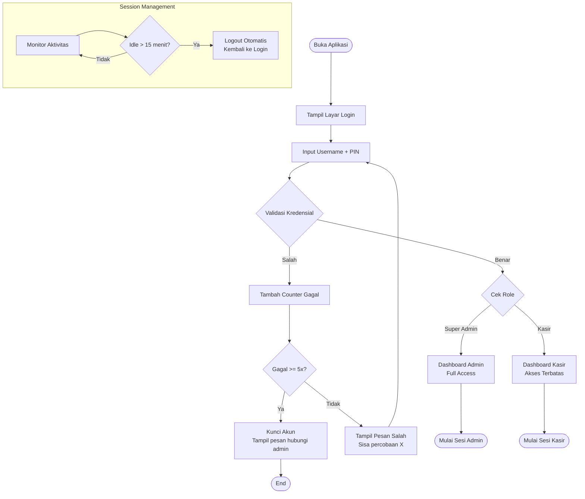

---

## 2. Flow Transaksi Penjualan (Kasir)

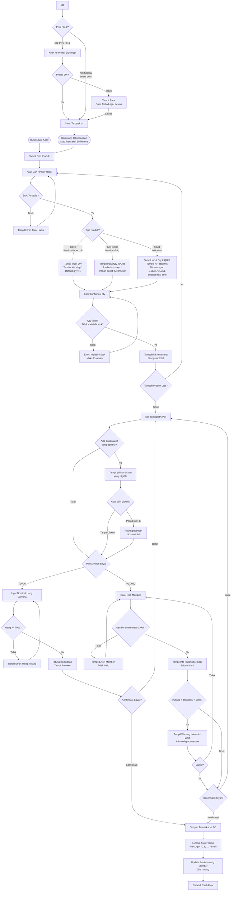

---

## 3. Flow Pembayaran Hutang Member

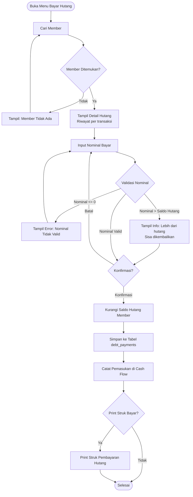

---

## 4. Flow Void Transaksi (Admin Only)

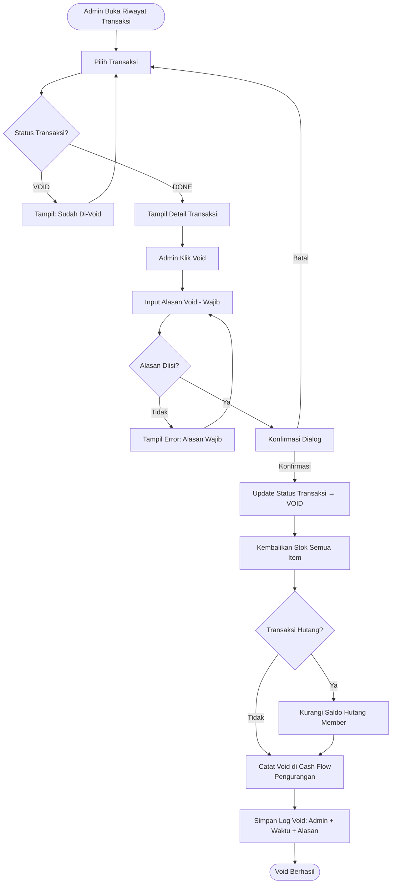

---

## 5. Flow Manajemen Produk (Admin)

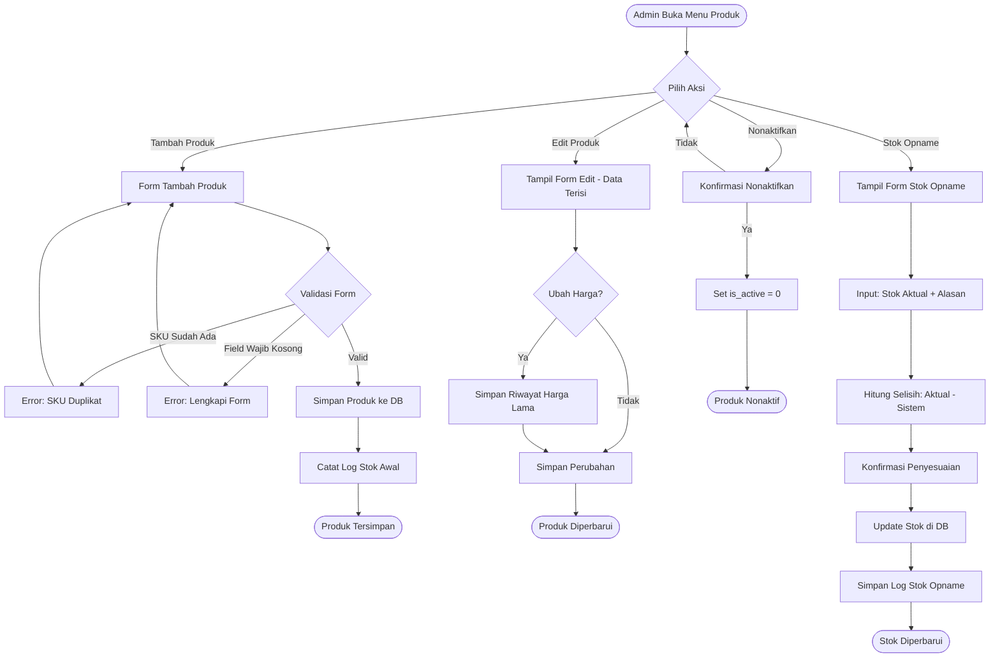

---

## 5b. Flow Manajemen Diskon (Admin)

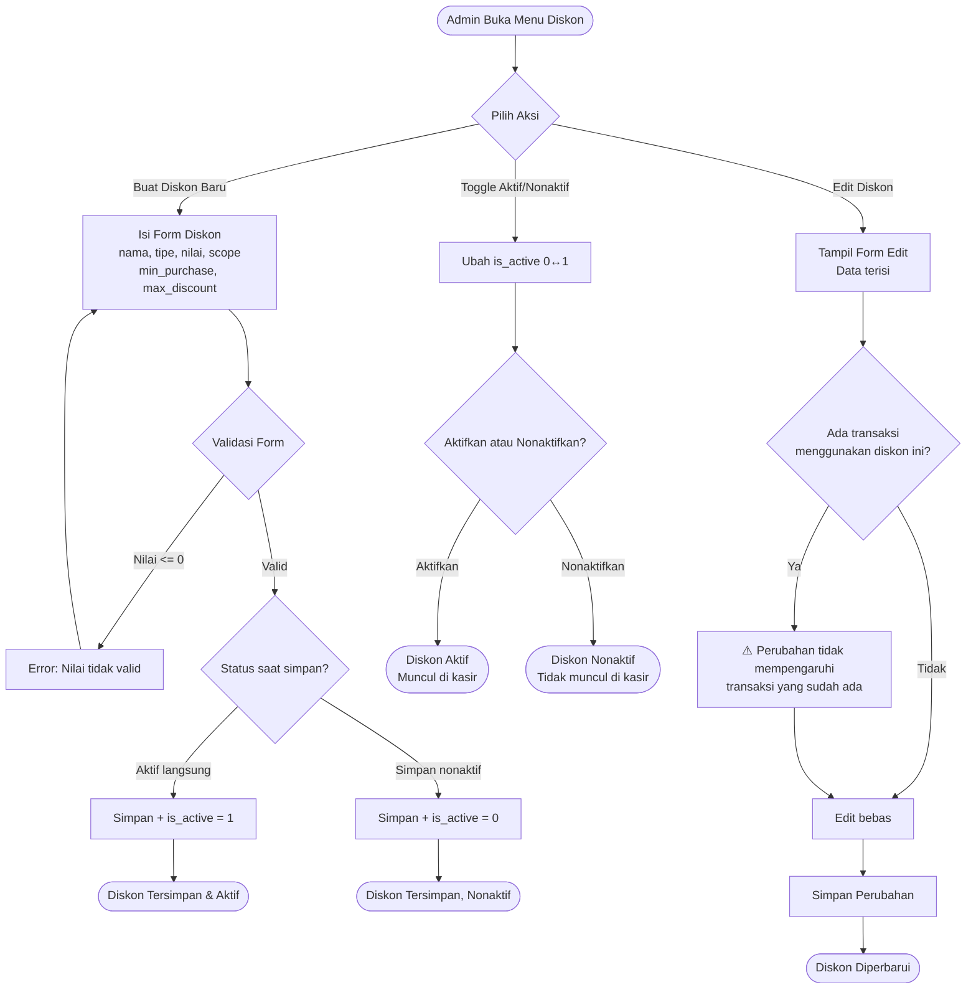

---

## 6. Flow Laporan & Export (Admin)

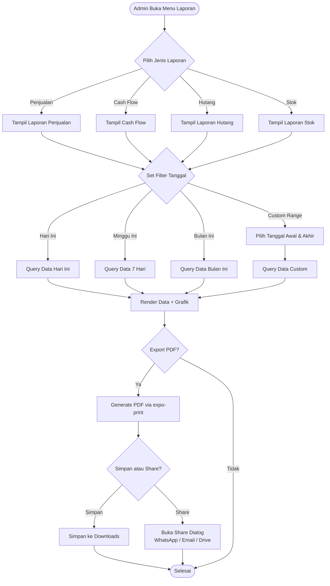

---

## 7. Flow Manajemen Member (Admin)

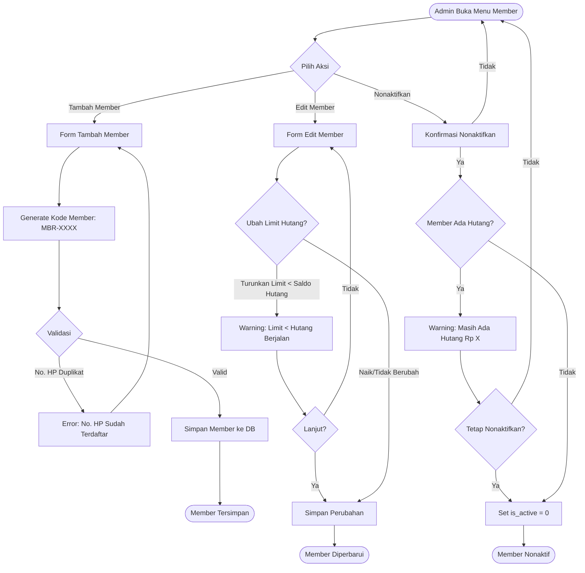

---

## 8. Flow Backup & Restore Data

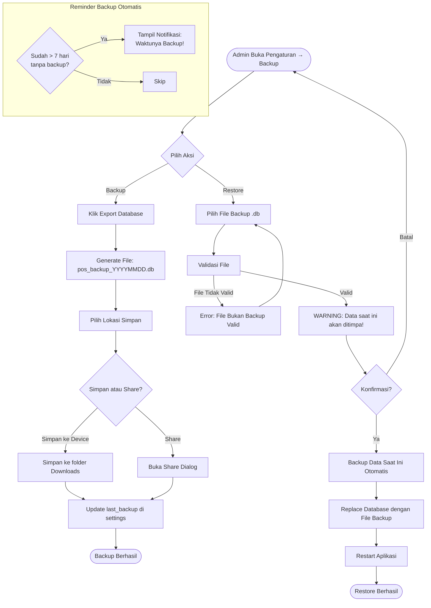

---

## 8b. Flow Pencatatan Pengeluaran Kas (Admin Only) [FEAT-02]

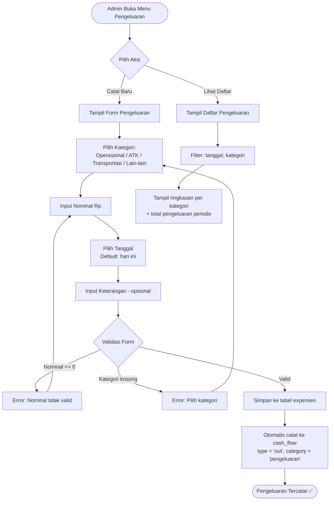

---

## 8d. Flow Cetak Ulang Struk [FEAT-04]

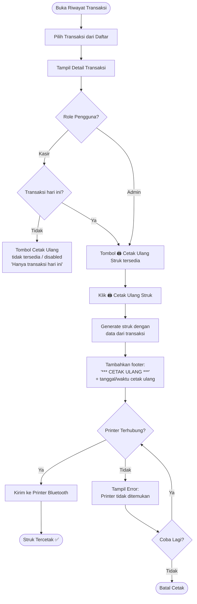

---

## 8e. Flow Surat Tagihan Hutang [FEAT-05]

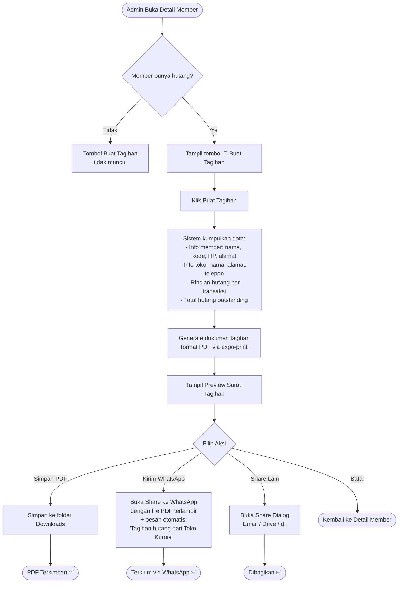

---

## 8f. Flow Mode Cek Harga [FEAT-06]

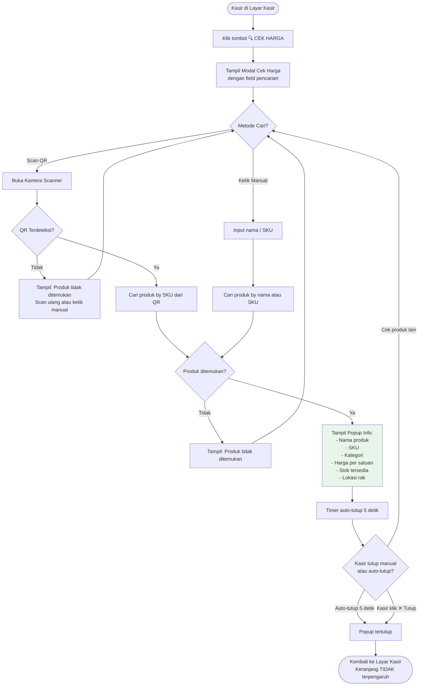

---

## 8g. Flow Laporan Laba Kotor (Admin Only) [FEAT-01]

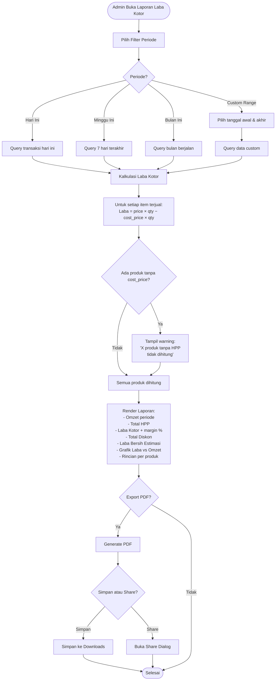

---

## 9. Diagram Alur Data (Data Flow Overview)

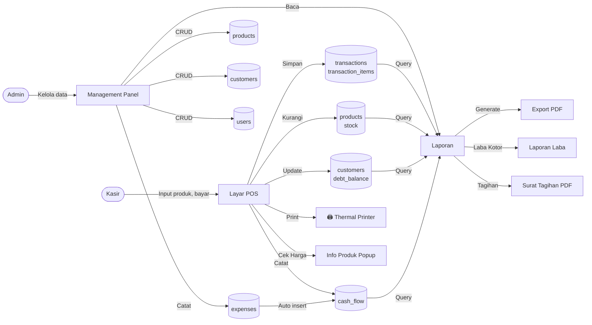

---

## 10. State Machine: Status Transaksi

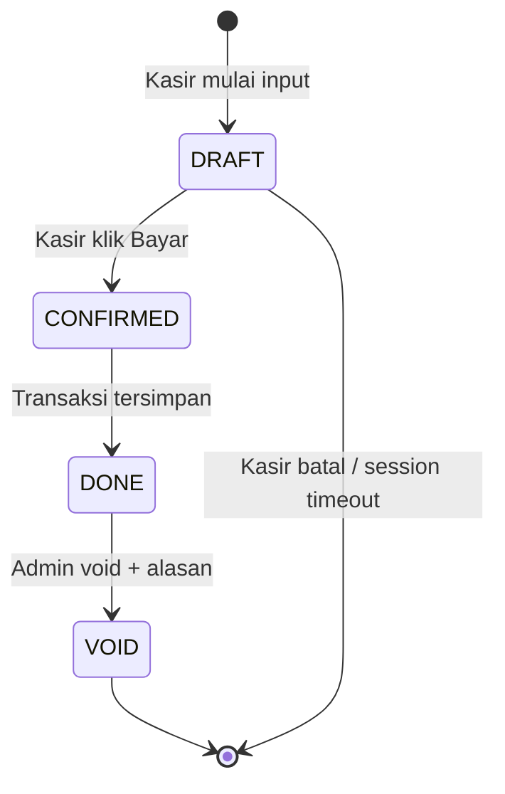

---

## 11. State Machine: Status Hutang Member

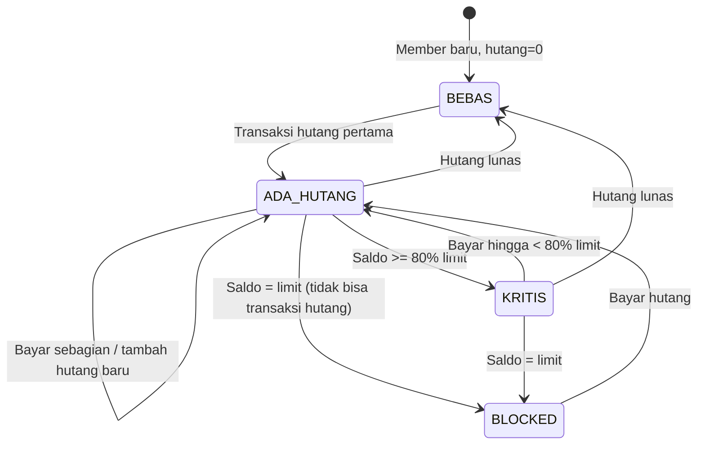

---

*Semua flowchart menggunakan sintaks Mermaid dan dapat dirender di GitHub, Notion, atau VS Code dengan ekstensi Markdown Preview Mermaid.*
